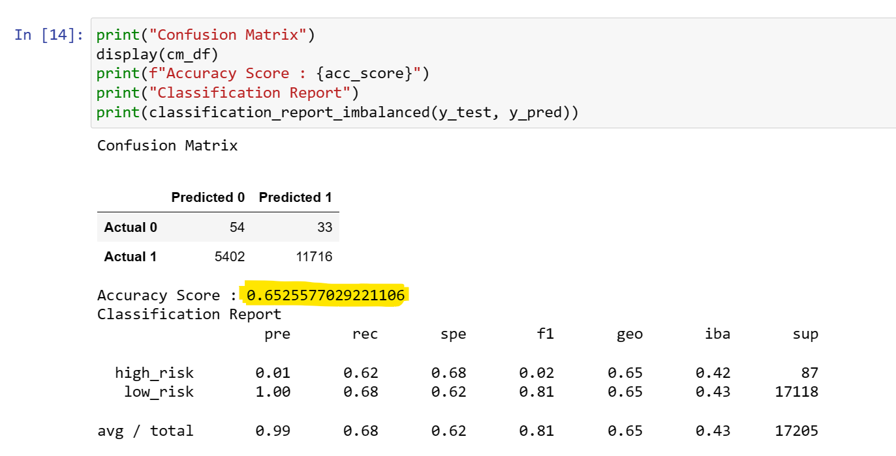
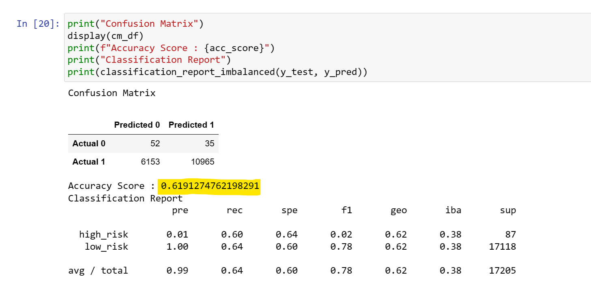
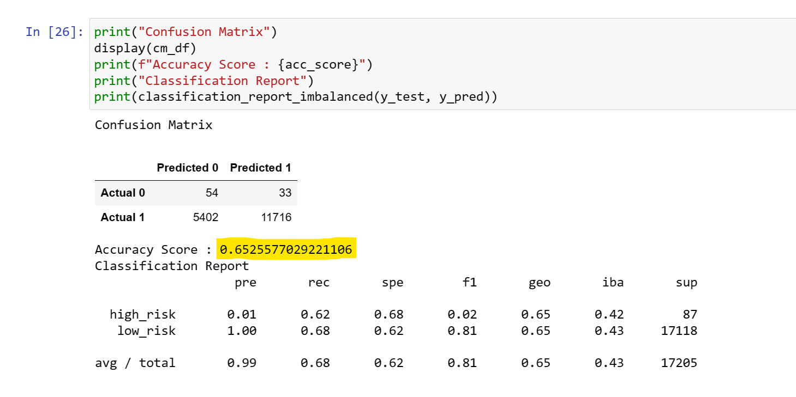
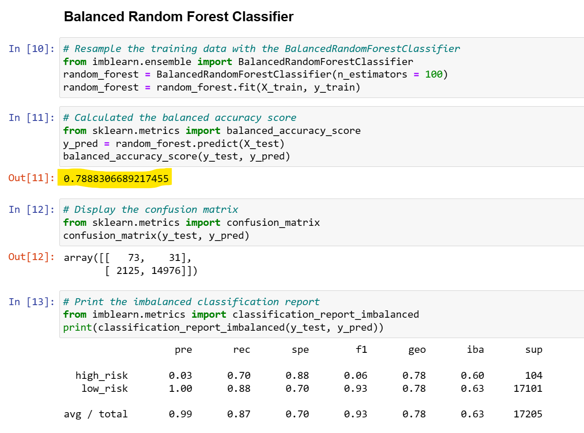
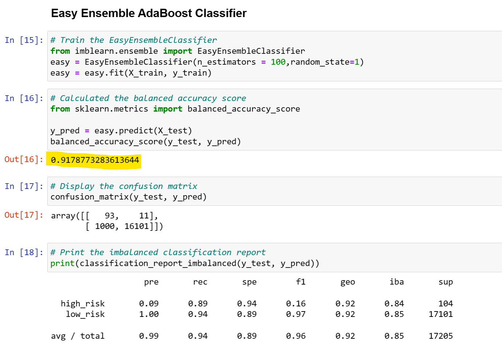

# Supervised-Machine-Learning-and-Credit-Risk

## Overview & Background
In 2019, more than 19 million Americans had at least one unsecured personal loan. That's a record-breaking number! Personal lending is growing faster than credit card, auto, mortgage, and even student debt. With such incredible growth, FinTech firms are storming ahead of traditional loan processes. By using the latest machine learning techniques, these FinTech firms can continuously analyze large amounts of data and predict trends to optimize lending.

In this module, you'll use Python to build and evaluate several machine learning models to predict credit risk. Being able to predict credit risk with machine learning algorithms can help banks and financial institutions predict anomalies, reduce risk cases, monitor portfolios, and provide recommendations on what to do in cases of fraud.

## Analysis & Results
1. Naive Random Oversampling: 
  - the balanced accuracy score is around 65.26%
  - the precision for the low_risk is about 100% and the recall is 68%
  - the precision for the high_risk has a very low positivity at only 1% and the recall is 62%

2. SMOTE oversampling:
  - the balanced accuracy score is around 61.91%
  - the precision for the low_risk is about 100% and the recall is lower than the "Naive Random Oversampling" which is 64%
  - same to the "Naive Random Oversampling", the precision for the high_risk is only 1% while the recall is 60%

3. Undersampling: 
  - the balanced accuracy score is roughly 65.26%
  - as same as above, the precision for the low_risk is about 100%. While the recall is 68%
  - same to the above, the precision for the high_risk is only 1% while the recall is 62%

4. Combination(over and undersampling): 
  - the balanced accuracy score is roughly 64.88%
  - as same as above, the precision for the low_risk is about 100%. In the meantime, the recall is 61%
  - same to the above, the precision for the high_risk is only 1% while the recall is higher which is 69%

5. Balanced Random Forest Classifier: 
  - the balanced accuracy score is roughly 78.89%
  - the precision for the low_risk is about 100%. In the meantime, the recall is 88%
  - the precision for the high_risk is higher than above analysis which we got 3% and the recall is higher as well which is 70%

6. Easy Ensemble AdaBoost Classifier: the accuracy score is 91.7% the precision is 99% and the recall is 94%
  - the balanced accuracy score is roughly 91.79%
  - the precision for the low_risk remains the same which is 100% and the recall is getting 94%
  - the precision for the high_risk is higher than all above analysis which we got 9% and the recall is higher as well which is 89%

## Summary
In this project analysis, we firstly used 4 different methods including: Naive Random Oversampling, SMOTE oversampling, Undersampling and Combination(over and undersampling). All accuracy scores are showing much similiar between 60%-66% and Smote oversampling gives the lowest accuracy score 61.91%. In the next step analysis, we start using resampling the data via ensemble classifiers to predict evaluate the risk levels. Per the results, the accuracy scores are significantly higher than first 4 models. Specifically, the accuracy score is almost 80% after the balanced random forest classifier and we got more than 90% accurate once easy ensemble AdaBoost classifier. In conclusion, the once easy ensemble AdaBoost classifier is the best model for the risk evaluation and prediction.

Recommendation
- for the future analysis, it's always good to compare different models before making the decision
- Easy Ensemble AdaBoost Classifier is well predict the risk levels. We recommend to use this model in the real market.

